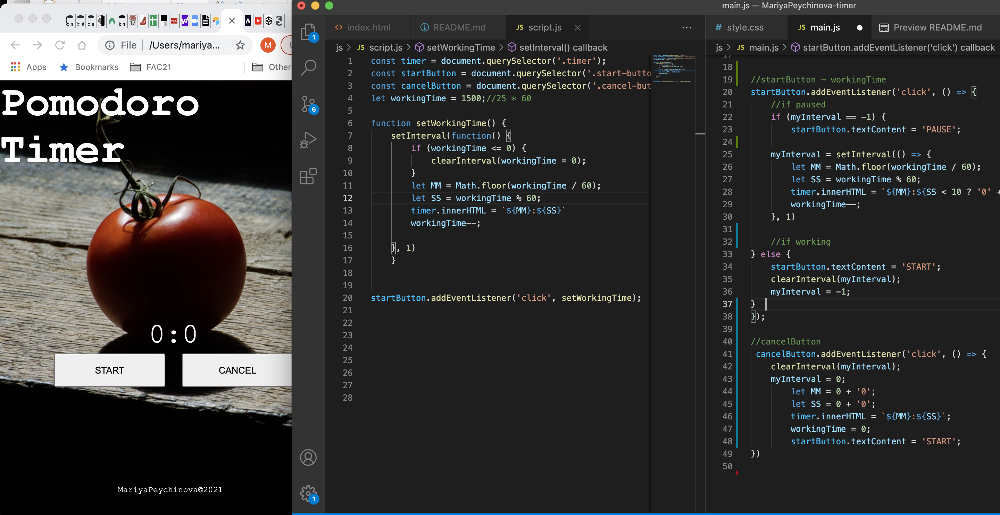

# MariyaPeychinova-timer
## Pomodoro timer mini-project from Workshop4 of FAC21 precourse

I started with creating a new private repository for my project within the FAC21 organisation on [GitHub](https://github.com/fac21/MariyaPeychinova-timer) and including a README.md.

Then, I cloned the repo in the Workshops directory on my device, using the link provided and pasting it in my terminal.

Using the terminal, in the MariyaPeychinova-timer directory I created new directories and new files for the HTML, CSS and Javascript. 

Starting with the html file, I created the main HTML page structure, including all necessary meta and semantic tags I decided my project needed. Then, started to add one by one the features of my page and styling them.

So I got up to this:  

And now what? 
I have no idea.
- First step - done: finally managed to create a function, which executes on click of the START button. The final countdown began!

What I did: 
1. Defined variables timer, startButton and cancelButton and assigned to them the selected elements from the HTML file. 
```javascript
const timer = document.querySelector('.timer');
const startButton = document.querySelector('.start-button');
const cancelButton = document.querySelector('.cancel-button');
```
2. Added an EventListener to the startButton to trigger on 'click' event, using an arrow function to define the inline function.
```javascript
startButton.addEventListener('click', () => {
})
```
3. I created a setInterval function in the eventListener to make the timer counts down from 25 and used a template literal to assign the changes in its innerHTML. I had to define variables for the startingMinutes and the workingTime, as I had to decrease it (workingTime--) in the function.
Also defined variables for the minutes and the seconds assigning to them their values.

```javascript
setInterval(() => {
        let MM = Math.floor(workingTime / 60);
        let SS = workingTime % 60;

        timer.innerHTML = `${MM}:${SS < 10 ? '0' + SS : SS}`;
        
        workingTime--;
    }, 1000)
```
    Let's try to work on changing the startButton now!
4. StartButton textContent changed on 'click' event in the eventListener.

```javascript
startButton.textContent = 'PAUSE';
```
Let's work on the logic for 'PAUSE' and 'START'.

5. That wasn't easy! 
With defining a new variable myInterval, I managed to do it. 
```javascript
 //if paused
    if (myInterval == -1) {
        startButton.textContent = 'PAUSE';  
    myInterval = setInterval(() => {
        let MM = Math.floor(workingTime / 60);
        let SS = workingTime % 60;
        timer.innerHTML = `${MM}:${SS < 10 ? '0' + SS : SS}`;
        workingTime--;
    }, 1) //just while checking, so is faster

    //if working
    } else {
        startButton.textContent = 'START';
        clearInterval(myInterval);
        myInterval = -1;
    }      
```
- _I made the mistake to commit .DS_Store file and now my terminal shows quote>
Will need to check what I did wrong and how to fix it._

_Apparently, I can't use ' in the message._ 

6. So how to make it stop when 00:00 and start the 5 minutes break? 
I tried everything with no success. 

__It took too long. Let's do something else!__

7. Added an EventListener to the cancelButton to trigger on 'click' event, using an arrow function to define the inline function and setInterval function in the eventListener to make the timer stop counting and used a template literal to assign the changes in its innerHTML.
```javascript
startButton.addEventListener('click', () => {
    clearInterval(myInterval);
    myInterval = 0;
        let MM = 0 + '0';
        let SS = 0 + '0';
        timer.innerHTML = `${MM}:${SS}`;
        workingTime = 0;
        startButton.textContent = 'START';
})
```
Now I need to take care of the workingTime and set it to start from 25 again after clicking startButton.

__I'm in trouble! Can't do it!__

__And I can't stop the timer when the 25 minutes have passed!__

8. After spending a quite long time researching what the problem could be and trying every single advice, I found in google and youtube, I am still unable to solve the problem.
My timer doesn't stop when workingTime <= 0.
I can't find where my mistake is.
So decided to refactor my code. For that reason, I'm creating another js file and hope that will work.

Refactoring didn't work! I can't stop the timer.

__No Panic!__

Let's start debugging!

I striped my code to spine only and guess what? 

# Success! 




Now I can have coffee!

I hope I will be able to add the rest of my code back.

## All good! 
Now I have two js files with a bit different syntax that work so far.

9. Next job - to take care of the workingTime and set it to start from 25 again on clicking the startButton after 'CANCEL'.
WOW, that was exciting!

10. It's time for the break! Ding-Dong!
The sound works finally!

11. Set 5 min breakTime!
Nearly there!
Need to fix the breakTime and to stop the sound.
It's not so easy!

The break timer sims to be running too fast. Hm!

Ok. BreakTime taken care of. 
I think.

No luck with the sound, though.

12. To summarise - workingTime and breakTime work perfectly, the sound still doesn't stop, but managed to change the backgroundImage on break and fixed the problem with its size. 

Also fallowing a suggestion from Dan, defined two variables to use when want to speed the timer a bit, so no longer need to stare at my code looking for the number to change.

## Happy!

HA-HA! The sound problem fixed. Just looked at it differently. Why would I need an alarm that I can't stop! 
:tada:  


Questions:
1. What is `.DS_Store`?
2. How to make the sound to stop repeating?

### If you are eager to see how my timer looks so far, click [here](https://fac21.github.io/MariyaPeychinova-timer/).